# CG - Computação Gráfica
### (Computer Graphics)

This repository contains all the class exercises for Computer Graphics. 

### Projeto - Simplified Example of a Tomography
Simplified example of a tomography: starting from a base image, we apply the Radon Transform, generate a Sinogram, and finally reconstruct the image using the Backprojection method.

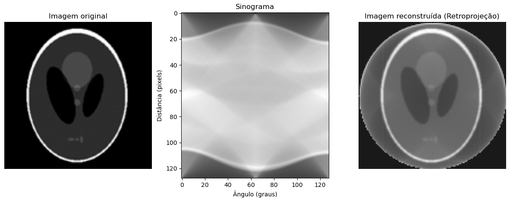

### ATV1 - Generation of Lines with Various Patterns and Circle Filling

Ex1: **Implement a Method in the `Line` Class**  
   Implement a method in the `Line` class (from the code used in class) to generate lines with different styles (such as dotted, dashed, or dash-dot). The method should take as input:  
   - The endpoints of the segment $$(x_1, y_1)$$ and $$(x_2, y_2)$$,
   - A pattern to be drawn (a bit vector).  
   For example:  
   - For a dash-dot style, the pattern could be `[1, 1, 0, 1, 0]`.  
   - For dashed lines, it could be `[1, 1, 0]`.  
   - For dotted lines, it could be `[1, 0]`.  
  #### Results:
  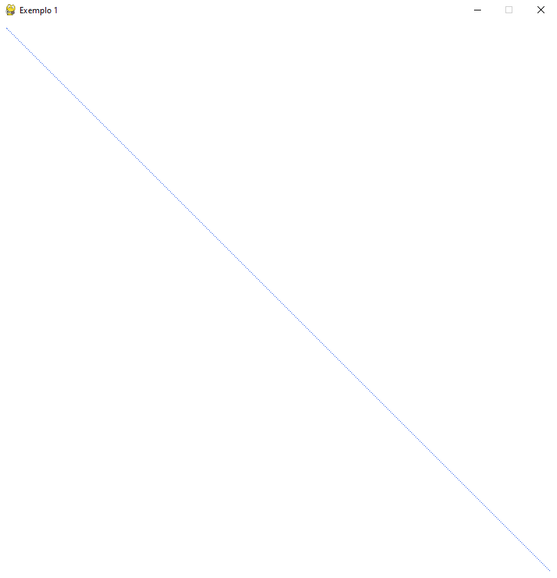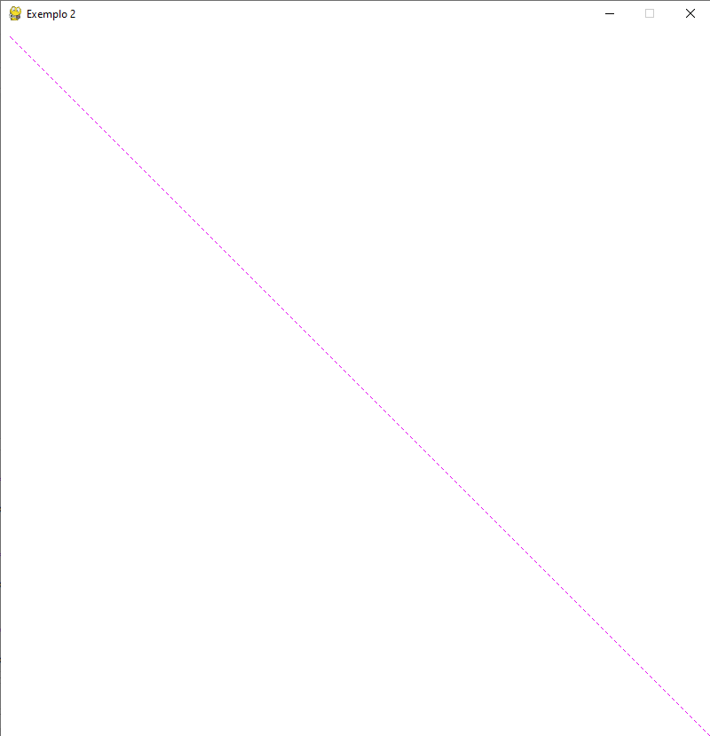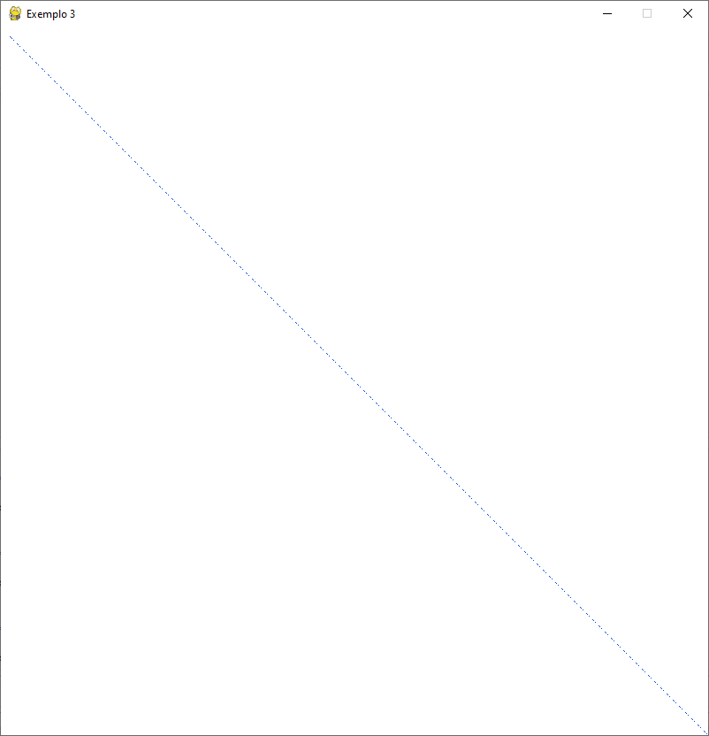

Ex2: **Implement a Method in the `Circle` Class**  
   Implement a method in the `Circle` class (from the code used in class) to generate a filled circle with a specified fill color different from its border color. Use **Bresenham's Algorithm** for this purpose. The method should take as input:  
   - The center coordinates $$(x_C, y_C)$$,
   - The radius,
   - The fill color.  
  #### Results:
  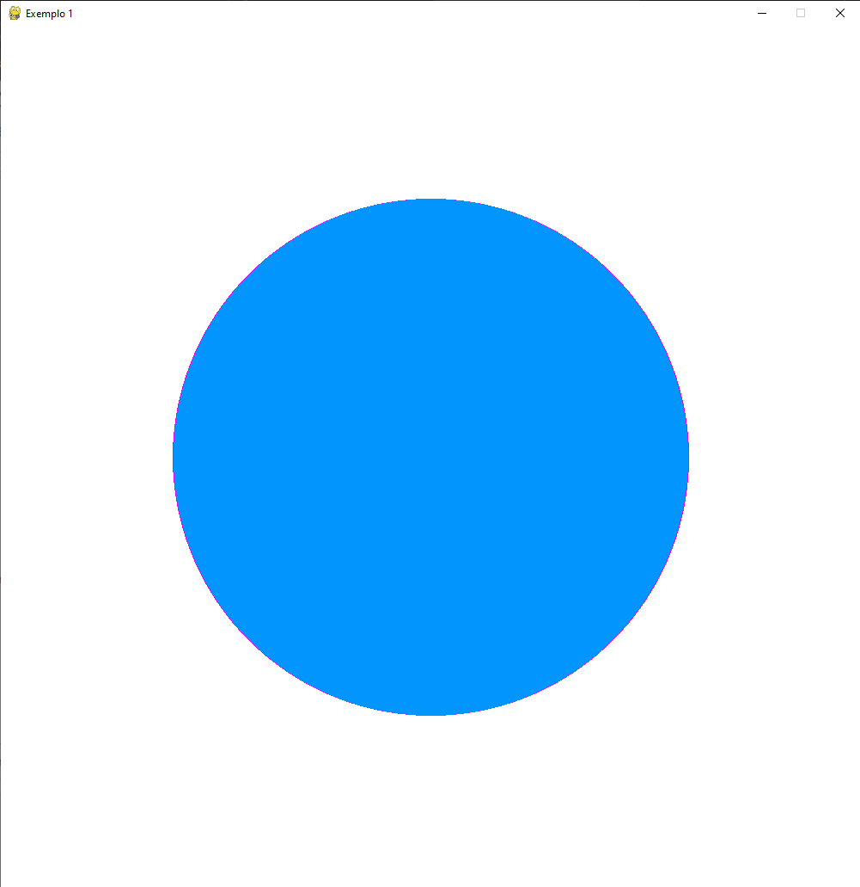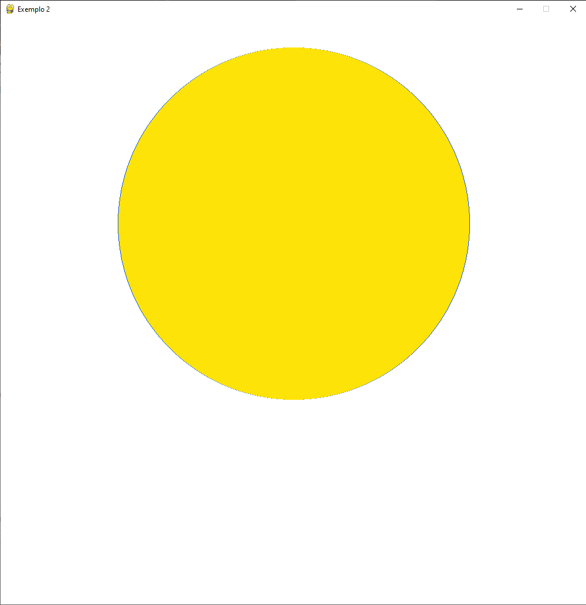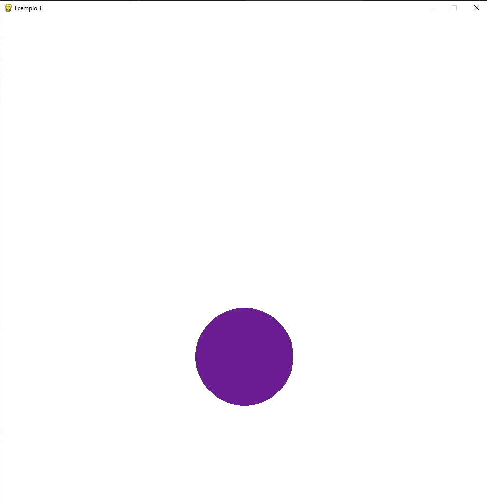

### ATV2 - Polygon Filling
Modify the implementation of the Scanline Algorithm to generate filled areas with a specified fill pattern (hatching). The idea is to create an implementation that accepts any pattern passed as a parameter. Use a matrix to represent the pattern, composed of 0 and 1 values that define the hatching to be drawn. For example, the matrix could define horizontal, vertical, or diagonal lines as hatching.
 #### Results:
  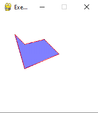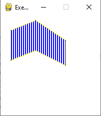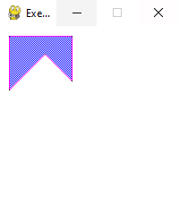

### ATV3 - Animation: Kicking a Ball
For this, use primitives for each part of the lower limb (thigh, leg, and foot). Consider the joints of the hip, knee, and ankle as pivot or reference points for transformations. Create a simple animation for the task of kicking a ball (another primitive). The illustration below helps to understand the process.
  #### Results: 
  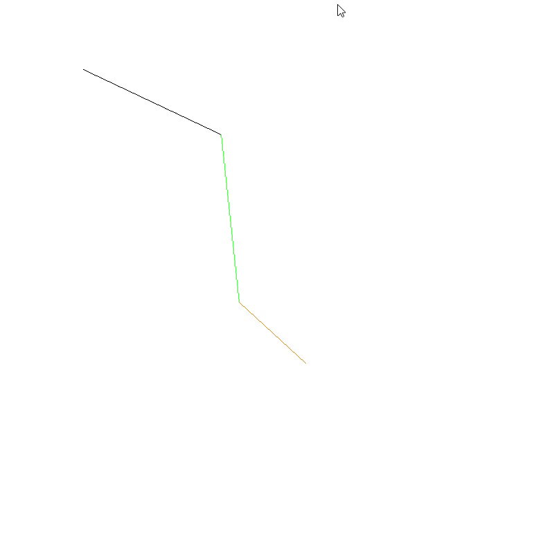
  
